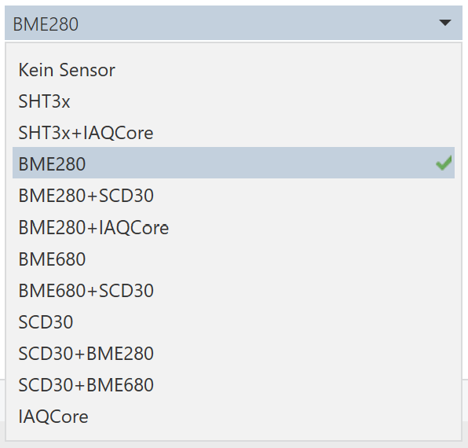
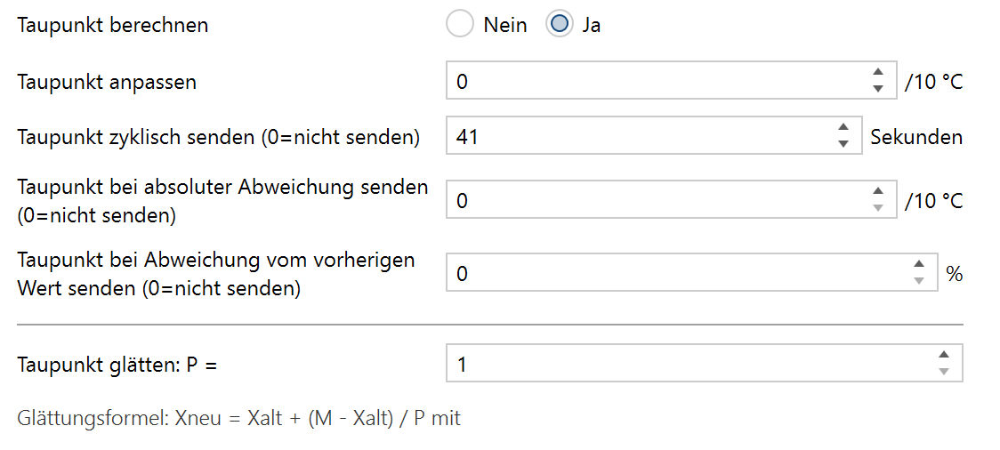
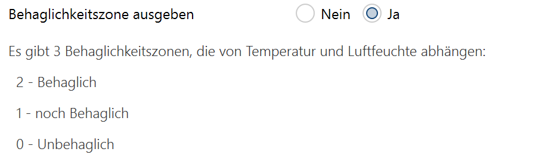

# Applikationsbeschreibung Sensor

Die Applikation Sensor ist im File Sensormodul-v2.x-yy.knxprod enthalten und erlaubt die Parametrisierung des Sensormoduls mittels der ETS.

Sie ist in die Bereiche

* Allgemeine Parameter
* Standardsensoren
* Logikdokumentation
* Logikkanäle

gegliedert.

Die letzeren beiden Punkte sind in der Applikationsbeschreibung Logik beschrieben.

## Änderungshistorie

17.04.2020: Firmware 1.1.0, Applikation 1.4 - 1.7

* Temperaturgrenzen in 'Temperatur anpassen (interner Messwert)' auf +-10°C erhöht. Auch für die anderen Messwerte wurden die Anpassungsintervalle erhöht.
* **inkompatible Änderung**: Statt dem Sensor HDC1080 wird jetzt der Sensor SHT3x unterstützt.
* Aktualisierung im Kapitel 'Update der Applikation'.
* Detailänderungen in der Logik, siehe Applikationsbeschreibung Logik.

01.02.2021 Firmware 2.0.0, Applikation 2.0 - 2.3

* Das Diagnoseobjekt ist jetzt Teil des Logikmoduls und wird auch in der Applikationsbeschreibung Logik dokumentiert. Es wird nicht mehr zusammen mit dem Fehlerobjekt ein- bzw. ausgeschaltet.
* **Inkompatible Änderung**: Zuordnungen zu Gruppenadressen gehen verloren, beschrieben im Kapitel 'Das "alte" Sensormodul aktualisieren'
* Anpassung im Kapitel 'Uhrzeit und Datum nach einem Neustart vom Bus lesen'
* Unterstützung vom neuen VOC-Sensor IAQCore, kann VOC- und (berechneten) CO2-Wert liefern
* Aktualisierung im Kapitel 'Update der Applikation'.

02.03.2021 Firmware 2.4.0, Applikation 2.4 - 2.7

* Dies ist ein reines Logik-Update, dokumentiert in der Applikationsbeschreibung Logik. Es gibt keine Auswirkungen auf die Funktionalität des Sensorteils.
* Ein update der Applikation (wie im entsprechenden Kapitel beschrieben) von einer vorherigen 2.x-Version funktioniert vollständig. Es gehen weder GA-Zuordnungen zu KO noch Parameter verloren.

05.03.2021: Firmware 2.4.1, Applikation 2.4 - 2.7

* FIX Logik: Das Blinkmodul hat fälschlicherweise den Ausgangszustand der Logik verändert. Das konnte bei "nur bei geändertem Ergebnis senden" auch zu unerwarteten Logik-Triggern führen. Immer wenn während des Blinkens am Eingang ein Signal ankam, dass invers zum Blinkstatus war, wurde unerwünscht getriggert.

29.03.2021 Firmware 2.5.0, Applikation 2.4 - 2.7

* Firmware-Update mit Watchdog-Unterstützung, neues Kapitel 'Watchdog-Unterstützung' hinzugefügt
* Für die Programmierung werden jetzt auch "Long Frames" unterstützt, sofern das die Schnittstelle und alle Koppler auf dem Programmierpfad unterstützen. Für 40 Logikkanäle sinkt die Programmierzeit von knapp 2 Minuten auf etwas mehr als eine halbe Minute (ist also um den Faktor 2.5 schneller). Getestet mit der MDT-IP-Schnittstelle.

05.04.2021 Firmware 2.5.1, Applikation 2.4 - 2.7

* Bugfix: Beim Programmieren des Sensormoduls ohne GA (also kein KO hat eine GA zugewiesen) konnte es passieren, dass danach das Modul so hängt, dass nur ein erneutes aufspielen der Firmware per USB das Problem beheben kann. Dies ist ein reines Firmware-Update.

## Allgemeine Parameter

Hier werden Einstellungen getroffen, die die generelle Arbeitsweise des Sensormoduls bestimmen.

### Anzahl verfügbarer Logikkanäle

Dieses Feld gibt an, für wie viele Logikkanäle dieses Applikationsprogramm erstellt wurde.

Es stehen ETS-Applikationen mit 10, 20, 40 und 80 Logikkanälen zur Verfügung. Für die Sensorapplikation macht die Anzahl der Logikkanäle keinen funktionalen Unterschied. Allerdings beeinflußt die Anzahl der Logikkanäle wesentlich die Programmierzeit mit der ETS. Ein Sensormodul mit 10 Logikkanälen braucht ca. 30 Sekunden für die Programmierung, mit 80 Logikkanälen weit über 3 Minuten. Die Programmierzeit hängt immer von der Anzahl der verfügbaren Logikkanäle ab, nicht von der Anzahl der genutzen.

### Zeit bis das Gerät nach einem Neustart aktiv wird

Nach einem Neustart des Geräts, sei es durch Busspannungsausfall, Reset über den Bus oder auch durch ein Drücken der Reset-Taste, kann man hier festlegen, wie viele Sekunden vergehen sollen, bis das Gerät seine Funktion aufnimmt.

Da das Gerät prinzipiell (sofern parametriert) auch Lesetelegramme auf den Bus senden kann, kann mit dieser Einstellung verhindert werden, dass bei einem Busneustart von vielen Geräten viele Lesetelegramme auf einmal gesendet werden und so der Bus überlastet wird.

### In Betrieb senden alle

Das Gerät kann einen Status "Ich bin noch in Betrieb" über das KO 1 senden. Hier wird das Sendeintervall in Sekunden eingestellt.

### Uhrzeit und Datum nach einem Neustart vom Bus lesen

Dieses Gerät kann Uhrzeit und Datum vom Bus empfangen. Nach einem Neustart können Uhrzeit und Datum auch aktiv über Lesetelegramme abgefragt werden. Mit diesem Parameter wird bestimmt, ob Uhrzeit und Datum nach einem Neustart aktiv gelesen werden.

Wenn dieser Parameter gesetzt ist, wird die Uhrzeit und das Datum alle 20-30 Sekunden über ein Lesetelegramm vom Bus gelesen, bis eine entsprechende Antwort kommt. Falls keine Uhr im KNX-System vorhanden ist oder die Uhr nicht auf Leseanfragen antworten kann, sollte dieser Parameter auf "Nein" gesetzt werden.

### Vorhandene Hardware

Die Firmware im Sensormodul unterstützt eine Vielzahl an Hardwarevarianten. Um nicht für jede Hardwarekombination ein eigenes Applikationsprogramm zu benötigen, kann über die folgenden Felder die Hardwareausstattung des Sensormoduls bestimmt werden.

**Die Angaben in diesem Teil müssen der vorhandenen Hardware entsprechen**, da sie das Verhalten der Applikation und auch der Firmware bestimmen. **Das Applikationsprogramm hat keine Möglichkeit, die Korrektheit der Angaben zu überprüfen.**

Falsche Angaben können zu falschern Konfigurationen der Applikation und somit zum **Fehlverhalten des Sensormoduls** führen.

#### Sensor

Mit dem Auswahlfeld Sensor wird der direkt an das Board angeschlossene Sensor ausgewählt. 

In den folgenden Anzeigefeldern wird angezeigt, welche Messungen von dem Sensor vorgenommen werden. Um alle unterstützten Messungen vornehmen zu können, muss man Sensorkombinationen (SCD30+BME280 oder SCD30+BME680 oder BME280+IAQCore) benutzen.

Die unterstützten Sensoren liefern folgende Messwerte:

Sensorauswahl | Temperatur | Luftfeuchte | Luftdruck | VOC | CO2 | CO2 (berechnet)
---|:---:|:---:|:---:|:---:|:---:|:---:
SHT3x   | X | X |   |   |   |
SHT3x+IAQCore | X | X | | X | | X
BME280  | X | X | X |   |   |
BME280+SCD30 | X | X | X |   | X |
BME280+IAQCore | X | X | X | X | | X
BME680  | X | X | X | X |   | X
BME680+SCD30 | X | X | X | X | X | X
SCD30   | X | X |   |   | X |
IAQCore | | | | X | | X

Die Auswahl von 1-Wire-Sensoren ist auch möglich, wird aber derzeit weder von der Applikation noch von der Firmware im Sensormodul unterstützt (zukünftige Erweiterung).

Wird beim Sensor "Kein Sensor" ausgewählt, ist kein Sensor direkt auf dem Board installiert. Dann wird das Modul ausschließlich als Logikmodul oder 1-Wire-Busmaster verwendet.

#### Temperatur

Dieses Anzeigefeld zeigt einen Haken, wenn der ausgewählte Sensor eine Temperaturmessung unterstützt.

Wird eine Sensorkombination ausgewählt, wird hinter dem Feld angezeigt, von welchem Sensor die Temperaturmessung kommt. Folgende Varianten sind möglich:

Sensorkombination | Temperaturmessung vom
---|---
BME280+SCD30 | BME280
BME680+SCD30 | BME680
SCD30+BME280 | SCD30
SCD30+BME680 | SCD30

Somit wird immer der zuerst angegebene Sensor für die Temperaturmessung herangezogen. Die Temperatur sollte immer von dem Sensor gemessen werden, der möglichst wenig von anderen Bauteilen beeinflußt wird und möglichst frei im Luftstrom hängt. Dementsprechend muss die passende Kombination ausgewählt werden.

#### Luftfeuchte

Dieses Anzeigefeld zeigt einen Haken, wenn der ausgewählte Sensor eine Messung der Luftfeuchtigkeit unterstützt.

Wird eine Sensorkombination ausgewählt, wird hinter dem Feld angezeigt, von welchem Sensor die Luftfeuchtemessung kommt. Folgende Varianten sind möglich:

Sensorkombination | Luftfeuchtemessung vom
---|---
BME280+SCD30 | BME280
BME680+SCD30 | BME680
SCD30+BME280 | SCD30
SCD30+BME680 | SCD30

Somit wird immer der zuerst angegebene Sensor für die Luftfeuchtemessung herangezogen. Die Luftfeuchte sollte immer von dem Sensor gemessen werden, der möglichst wenig von anderen Bauteilen beeinflußt wird und möglichst frei im Luftstrom hängt. Dementsprechend muss die passende Kombination ausgewählt werden.

Es ist nicht möglich, die Temperatur und die Luftfeuchte von verschiedenen Sensoren messen zu lassen.

#### Luftdruck

Dieses Anzeigefeld zeigt einen Haken, wenn der ausgewählte Sensor eine Messung des Luftdrucks unterstützt.

#### Voc

Dieses Anzeigefeld zeigt einen Haken, wenn der ausgewählte Sensor eine Messung von flüchtigen organischen Verbindungen (engl. volatile organic compounds, kurz Voc) unterstützt.

#### CO2

Dieses Anzeigefeld zeigt einen Haken, wenn der ausgewählte Sensor eine Messung von Kohlendioxid (CO2) unterstützt.

Bei der Auswahl vom BME680 oder IAQCore wird auch CO2 angezeigt. Hier ist anzumerken, dass der BME680 bzw. IAQCore nur ein berechnetes CO2-Äquivalent passend zum gemessenen Voc-Wert ausgibt und keinen gemessenen CO2-Wert.

#### 1-Wire

Dieses Eingabefeld kann bei jedem Sensor zusätzlich ausgewählt werden, falls an das Sensormodul auch 1-Wire-Sensoren angeschlossen sind. Eine weitere Seite zur Detaileinstellungen für 1-Wire-Sensoren wird dann verfügbar.

Anmerkung: Die Einstellungen und die Abfrage von 1-Wire-Sensoren sind derzeit noch nicht unterstützt.

#### Akustischer Signalgeber vorhanden (Buzzer)?

Das Sensormodul unterstützt auch die Ausgabe von Pieptönen mittels eines Buzzers. Mit einem Haken in diesem Feld wird angegeben, ob ein Buzzer installiert ist.

#### Optischer Signalgeber vorhanden (RGB-LED)?

Das Sensormodul unterstützt auch die Ausgabe eines Lichtsignals mittels einer RGB-LED. Mit einem Haken in diesem Feld wird angegeben, ob eine RGB-LED installiert ist.

Wird eine RGB-LED und der CO2-Sensor ausgewählt, erscheint folgende Information:

Diese Information besagt, dass der Betrieb einer RBG-LED und des CO2-Sensors gleichzeitig nicht empfohlen wird, sofern das Sensormodul vom KNX-Bus gespeist werden soll. Da der vom KNX-Bus gelieferte Strom nicht für den Betrieb beider ausreicht, kann es zu Funktionsstörungen kommen, bis hin zu Resets des Sensormoduls und zum Funktionsausfall. Falls das Sensormodul über eine zusätzliche Stromversorgung verfügt (z.B. USB), kann diese Einstellung so belassen werden. Die Applikation wird bei dieser Einstellung nicht weiter eingeschränkt.

#### Nichtflüchtiger Speicher vorhanden (EEPROM)

Ein EEPROM ist ein Speicher, der seine Informationen auch nach einem Stromausfall nicht verliert. Ein solches EEPROM wird von der Firmware genutzt, um Werte von bestimmten Kommunikationsobjekten zu speichern und die Kalibrierungsdaten vom Voc-Sensor (BME 680).

Ist kein EEPROM auf dem Board vorhanden, können diese Informationen nicht gespeichert werden. Die Applikation wird dann alle Einstellungen, die ein Speichern erlauben, nicht anbieten. In einem solchen Fall erscheinen eine oder zwei der folgenden Informationen:

#### Zusatzhardware abschaltbar (z.B. mit dem NCN5130)?

Damit bei einem Stromausfall Daten in einem EEPROM gespeichert werden können, muss nicht nur ein EEPROM vorhanden sein, sondern auch genügend lange Strom zum Speichern vorhanden sein. Angeschlossene Hardware (Sensoren, LED, Buzzer, 1-Wire-Busmaster) verbrauchen aber viel Strom und verhindern somit die Speicherung bei Stromausfall.

Die Firmware unterstützt aber eine Abschaltung der Hardware, falls der Strom ausfällt. Derzeit wird die Abschaltung nur über den NCN5130 (KNX-Bus-Interface) unterstützt, kann aber bei Bedarf entsprechend um weitere Abschaltmöglichkeiten erweitert werden.

Ist keine Möglichkeit zur Abschaltung vorhanden, wird die Speicherung ins EEPROM unterbunden. Die Applikation wird dann alle Einstellungen, die ein Speichern erlauben, nicht anbieten. In einem solchen Fall erscheint die folgende Information:

### Fehler- und Diagnoseobjekt anzeigen

Das Fehlerobjekt (KO 11) meldet bitweise Sensorfehler.

* Bit 0: Fehler in der Logik (zyklus, der nicht aufgelöst werden kann)
* Bit 1: Fehler bei der Messung der Temperatur
* Bit 2: Fehler bei der Messung der Luftfeuchte
* Bit 3: Fehler bei der Messung des Luftdrucks
* Bit 4: Fehler bei der Messung der Voc
* Bit 5: Fehler bei der Messung vom CO2
* Bit 6: Derzeit nicht belegt
* Bit 7: Fehler im 1-Wire-Busmaster
* Bit 8-15: Fehler des jeweiligen 1-Wire-Sensors

Das Diagnoseobjekt (KO 12) ist derzeit für interne Verwendung (für Debug-Zwecke) vorgesehen und sollte in der Praxis nicht mit einer GA belegt werden.

## Standardsensoren

Zu den Standardsensoren zählen die Sensoren, die unter den Allgemeinen Einstellungen im Feld "Sensor" ausgewählt werden können. Diese Sensoren werden von der Applikation bestens unterstützt. Alle Messwerte vom Standardsensoren (Temperatur, Luftfeuchte, Luftdruck, Voc und CO2) erlauben die gleichen Einstellungen, die im Folgenden detailliert für die Temperatur beschrieben werden. Für die weiteren Messwerte werden dann nur noch die Einheiten genannt, in den die Eingaben zu erfolgen sind.

### Temperatur anpassen (interner Messwert)

Mit dieser Einstellung kann der Sensor kalibriert werden. Der eingegebene Wert wird zum gemessenen Wert addiert. Man kann die Temperatur um -10°C absenken und bis zu +10°C erhöhen. Die Werte werden in  0.1°C angegeben, so dass die Eingabe von -100 bis +100 in ganzen Zahlen zu erfolgen hat.

### Externe Messwerte berücksichtigen

Es können bis zu 2 externe Temperatur-Messwerte mit dem intern gemessenen verrechnet werden und als Gesamtmesswert ausgegeben werden. Dabei kann angegeben werden, in welchem Verhätnis die externen und der intere Messwert zueinander stehen. Eine Angabe von 60:30:10 würde bedeuten, dass der intere Messwert zu 60%, der externe Messwert 1 zu 30% und der externe Messwert 2 zu 10% in den Gesamtmesswert einfließt. Es sind aber auch durchaus Angaben wie 12:6:2 möglich (gleichbedeutend zu 60:30:10).

Solange ein externer Messwert noch nicht empfangen wurde, ist sein Anteil (nicht sein Wert) 0, wird also beim Gesamtergebnis nicht berücksichtigt.

In der Auswahlbox wird angegeben, ob 0, 1 oder 2 externe Messwerte berücksichtigt werden sollen.

#### Anteil interner Messwert

Erscheint nur, wenn externe Werte berücksichtigt werden sollen. Gibt den Anteil des internen Messwerts am Gesamtmesswert an.

#### Anteil externer Messwert 1

Erscheint nur, wenn externe Werte berücksichtigt werden sollen. Gibt den Anteil des ersten externen Messwerts am Gesamtmesswert an.

#### Anteil externer Messwert 2

Erscheint nur, wenn 2 externe Werte berücksichtigt werden sollen. Gibt den Anteil des zweiten externen Messwerts am Gesamtmesswert an.

#### Externe Messwerte beim Start lesen

Erscheint nur, wenn externe Werte berücksichtigt werden sollen. Ein "Ja" führt zu einem Lesen der externen Werte beim Neustart des Gerätes. Siehe hier auch Allgeimeine Einstellungen -> Zeit bis das Gerät nach einem Neustart aktiv wird.

### Temperatur zyklisch senden (0 = nicht senden)

Die Temperatur kann in bestimmten Zeitintervallen auf den Bus gesendet werden. Hier wird das Zeitintervall in Sekunden angegeben.

Wird eine 0 angegeben, wird die Temperatur nicht zyklisch gesendet.

### Temperatur bei absoluter Abweichung senden (0 = nicht senden)

Die Temperatur kann auch gesendet werden, wenn der aktuell gemessene Wert um eine festgelegte Temperatur von dem zuletzt gesendeten Wert nach oben oder unten abweicht.

Hier wird die Abweichung in 0.1°C angegeben. Soll also bei einer Abweichung von 0.5°C gesendet werden, muss hier eine 5 angegeben werden.

Wird eine 0 angegeben, wird bei einer absoluten Abweichung nicht gesendet.

### Temperatur bei relativer Abweichung senden (0 = nicht senden)

Die Tempeartur kann auch gesendet werden, wenn der aktuell gemessene Wert um einen bestimmten Prozentsatz von dem zuletzt gesendeten Wert nach oben oder unten abweicht.

Hier wird die Abweichung in % angegeben. Bei einem zuletzt gesendeten Wert von 20°C und einen angegebenen Abweichung von 5% wird erneut gesendet, wenn die gemessene Temperatur 21°C überschreitet oder 19°C unterschreitet (5% von 20°C sind 1°C).

Wird eine 0 angegeben, wird bei einer relativen Abweichung nicht gesendet.

### Temperatur glätten: P =

Falls der Sensor zu emfpindlich ist und man starke Schwankungen im Temperaturmesswert hat, kann man eine Glättungsfunktion nutzen, um starke Messwertschwankungen abzumildern. Die hier verwendete Funktion ist vergleichbar mit einer Durchschnittsberechnung über eine gewisse Anzahl vergangener Messwerte, funktioniert aber im Detail anders.

Es wird folgende Glättungsformel verwendet:

Xneu = Xalt + (M - Xalt) / P

wobei

* Xneu der geglättete Wert,
* Xalt der zuvor ermittelte geglättete Wert,
* M der aktuelle Messwert und
* P der einzugebende Glättungsfaktor

ist. Intern wird alle 5 Sekunden ein neuer Messwert ermittelt, der dann mittels dieser Formel geglättet wird. Ein P von 1 führt zu keiner Glättung, jeder Messwert wird übernommen. Ein Wert von 12 führt zu einer Glättung über die Werte einer Minute (5s * 12 = 60s), ein Wert von 120 zu einer Glättung von 10 Minuten und 720 zu einer Glättung von einer Stunde.

Die Glättung wird durchgeführt, bevor eine Sendebedingung für die absolute oder relative Abweichung ermittelt wird.

Der neu ermittelete Wert wird alle 5 Sekunden auf das entsprechende KO geschrieben, ganz egal, ob das KO diesen Wert sendet oder nicht. Somit können vom Sensormdul alle 5 Sekunden aktuelle Sensorwerte gelesen werden, unabhängig von parametriesierten Sendebedingungen.

## Standardsensoren - Temperatur

Die Temperatureinstellungen sind wie unter Standardsensoren beschrieben. Alle Temperaturangaben werden in 0.1°C vorgenommen.

## Standardsensoren - Luftfeuchte

Einstellungen für Luftfeuchte werden wie unter Standardsensoren beschrieben vorgenommen. Alle Angaben für Luftfeuchte werden in % vorgenommen.

## Standardsensoren - Luftdruck

Erscheint nur, wenn der angeschlossene Sensor auch einen Messwert für Luftdruck liefert.

Einstellungen für Luftdruck werden wie unter Standardsensoren beschrieben vorgenommen. Alle Angaben für Luftdruck werden in Millibar (mBar) vorgenommen.

## Standardsensoren - Voc

Erscheint nur, wenn der angeschlossene Sensor auch einen Messwert für Voc liefert.

Einstellungen für Voc werden wie unter Standardsensoren beschrieben vorgenommen. Alle Angaben für Voc sind einheitenlos und werden in ganzen Zahlen vorgenommen.

## Standardsensoren - CO2

Erscheint nur, wenn der angeschlossene Sensor auch einen Messwert für CO2 liefert.

Einstellungen für CO2 werden wie unter Standardsensoren beschrieben vorgenommen. Alle Angaben für CO2 werden in Parts-Per-Million (ppm) vorgenommen.

Anmerkung zum BME680: Dieser Sensor liefert nur ein berechnetes CO2-Äquivalent passend zum gemessenen Voc-Wert und keinen gemessenen CO2-Wert. Dieser berechnete CO2-Wert wird über ein zusätzliches KO 20 ausgegeben.

Ist die Sensorkombination BME680+SCD30 installiert, werden beide CO2-Werte augegeben, der gemessene und der berechnete.

Anmerkung zum SDC30: Derzeit wird bei diesem Sensor die Nutzung vom Watchdog empfohlen (Siehe Kapitel Watchdog-Unterstützung). Mit diesem Sensor kommt es zu sporadischen "Hängern", deren Ursache noch nicht bekannt ist.

## Standardsensoren - Zusatzfunktionen

Das Sensormodul kann neben gemessenen Werten auch noch einige berechnete Werte liefern. Dazu zählen der Taupunkt, Behaglichkeit, Luftqualitäsampel und Messgenauigkeit.

### Taupunkt berechnen

Wenn man hier "Ja" auswählt, kann man für den Taupunkt Einstellungen wie unter Standardsensoren beschrieben vornehmen. Alle Angaben für den Taupunkt werden in 0.1°C vorgenommen.

### Behaglichkeitszone ausgeben

Wenn man hier "Ja" auswählt, wird anhand der Temperatur und Luftfeuchte eine Behaglichkeitszone berechnet und über KO 22 ausgegeben. Die Behaglichkeitszone kann jederzeit gelesen werden, wird aber nur bei Änderungen gesendet.

Falls zyklisches Senden gewünscht wird, kann man dies über die im Sensormodul enthaltenen Logikkanäle realisieren. Beispiele sind in der Applikationsbeschreibung Logik enthalten.

Folgende Behaglichkeitszonen werden berechnet:

* 2 - behaglich
* 1 - noch behaglich
* 0 - unbehaglich

### Luftqualitätsampel ausgeben

Dieser Punkt ist nur sichtbar, wenn ein angeschlossener Sensor Messwerte zur Luftqualität liefert, also nur beim BME680 oder SCD30.

Wenn man hier "Ja" auswählt, wird anhand des gemessenen Voc-Werts (beim BME680) oder des gemessenen CO2-Werts eine Luftqualitätsampel berechnet und über KO 23 ausgegeben. Die Luftqualitätsampel kann jederzeit gelesen werden, wird aber nur bei Änderungen gesendet.

Falls zyklisches Senden gewünscht wird, kann man dies über die im Sensormodul enthaltenen Logikkanäle realisieren. Beispiele sind in der Applikationsbeschreibung Logik enthalten.

Es gibt 6 Luftqualitätsgrade, entsprechend deutschen Schulnoten:

* 1 - sehr gut
* 2 - gut
* 3 - befriedigend (bei Gelegenheit lüften)
* 4 - ausreichend (lüften empfohlen)
* 5 - mangelhaft (lüften)
* 6 - ungenügend (unbedingt lüften)

### Kalibrierungsfortschritt ausgeben

Wird nur sichtbar, wenn als Sensor BME680 ausgewählt ist.

Manche Sensoren benötigen eine Klaibrierung, bevor sie zuverlässige Werte ausgeben können. Dies ist besonders für die Erfassung von Voc-Werten notwendig. Das Sensormodul hat für den BME680 eine Selbstkalibrierung implementiert, die ununterbrochen parallel zur Messwerterfassung läuft und alle 6 Stunden die bisher ermittelten Kalibrierungswerte in einem eigens hierfür eingebauten EEPROM speichert. Somit wird verhindert, dass nach einem Neustart des Gerätes eine erneute Kalibrierung notwendig wird.

Bei einer Erstinbetriebnahme, nach dem Einspielen einen neuen Firmware oder in seltenen Fällen auch im normalen Betrieb ist es notwendig, dass sich der Sensor BME680 neu kalibriert. Dies ist daran zu erkennen, dass der Sensor für den Voc-Wert konstant eine 25 liefert und als Kalibrierungsfortschritt über das KO 24 der Wert 0% geliefert wird.

Nach ca. 5 Minuten werden die ersten Voc-Werte ungleich 25 geliefert mit einem Kalibrierungsfortschritt von 33%. Diese ersten Werte sind noch immer nicht sinnvoll zu verwenden.

Nach einiger Zeit (hängt von der Raumgröße, Luftqualität, Lüftungszustand etc. ab) geht der Kalibrierungsfortschritt auf 66%, gefolgt von einem Wert von 100%. Dies kann insgesamt 6 bis 48 Stunden dauern und entspricht einer normalen Funktion des BME680.

Der Kalibrierungsfortschritt kann mit dieser Einstellung zur Information über KO 24 ausgegeben werden, hat aber auf die Funktion keinerlei Einfluss.

### Kalibrierungsdaten löschen

Die Applikation erlaubt auch ein explizitel Löschen der Kalibrierungsdaten. Allerdings wäre es sinnlos, hierfür einen Ja-Nein-Parameter eingzführen, da dieser, einmal auf Ja gestellt, nach jedem Neustart des Gerätes die Kalibrierungsdaten löschen würde. Insofern funktioniert dieser Parameter anders!

Eine Änderung des Wertes von 17 auf 23 führt nach den nächsten Upload der Applikation zum Löschen der Kalibrierungsdaten. Diese werden dann automatisch wieder aufgebaut und bleiben auch erhalten, egal wie oft die Applikation danach wieder hochgeladen wird. Die Firmaware des Gerätes verbindet die aktuellen Kalibrierungsdaten mit dem Wert des Parameters, solange der Parameter seinen Wert behält, sind auch die Applikationsdaten gültig.

Wird irgendwann einmal der Wert wieder von 23 auf 17 geändert, werden die Kalibrierungsdaten wieder gelöscht, neu aufgebaut und mit dem Wert 17 verbunden. Will man somit wieder löschen, ändert man wieder auf 23 u.s.w.

Im Allgemeinen sollte es nicht nötig sein, die Kalibrierungsdaten zu löschen. Somit sollte dieser Parameter einfach unverändert bleiben.

## Watchdog-Unterstützung

Das Modul unterstützt auch einen Watchdog. Dies ist eine Schaltung, die dafür sorgt, dass ein undefinierter Modulzustand, in dem das Modul nicht mehr auf KNX-Telegramme reagiert, zu einem Modul-Neustart führt.

Für reine Sensoren sind Watchdogs eine gute Lösung, um Hänger zu vermeiden. Ein solcher Neutstart geht schnell und der Sensor liefert wieder seine Werte. Nach dem Neustart werden wie gewohnt alle Messwerte auf den Bus gesendet. Somit kommt ein Messwert außer der Reihe, also z.B. schon nach 2 Minuten und erst dann wieder alle 5 Minuten. Da man normalerweise auch Messwerte bei bestimmten Abweichungen senden lässt, die dann auch außer der Reihe kommen, ist das vertretbar.

Wenn man Logiken nutzt, muss man diese so aufbauen, dass sie stabil gegenüber einem Neustart sind, der ja jederzeit vorkommen kann. Keiner will mitten in der Nacht vom Buzzer geweckt werden. Das Logikmodul erlaubt sehr viele "Startup-Einstellungen", um das möglichst feingranular steuern zu können. Allerdings muss man das auch machen! Wenn man also Logiken macht und den Watchdog benutzt, muss man die Logiken nicht nur auf Funktion, sondern auch auf Neustartverhalten testen. Der komfortabelste Weg hier ist in der ETS "Gerät zurücksetzen". Man kann diesen Befehl aber auch über eine Logik auslösen und z.B. auf eine Taste legen. So kann man in der Testphase jederzeit spontan das Gerät zurücksetzen und sehen, ob es Seiteneffekte bei Neustart gibt.

Der Watchdog ist derzeit nur über eine Compileroption schaltbar, man muss danach die Firmware neu compilieren und auf das Modul aufspielen. Beschrieben ist das in den Dokumenten knx-dev-setup.pdf und knx-update-setup.pdf.

In einer zukünftigen Version der Applikation wird man auch den Watchdog über die Applikation ein- und ausschalten können.

Derzeit wird der Watchdog bei der Verwendung vom SCD30 (CO2-Sensor) empfohlen, da dessen API zu sporadischen Hängern führt.

## Update der Applikation

Es gibt verschiedene Versionen dieser Applikation:

* Sensormodul-v2.4-10.knxprod
* Sensormodul-v2.5-20.knxprod
* Sensormodul-v2.6-40.knxprod
* Sensormodul-v2.7-80.knxprod

Diese Versionen unterscheiden sich nur in der Anzahl der nutzbaren Logikkanäle, angegeben durch die Zahl, die direkt vor der Endung "knxprod" steht. Dies ist sinnvoll, da sich die Anzahl der Logikkanäle erheblich auf die Zeit auswirkt, die die ETS zum programmieren benötigt. Eine Applikation mit 10 Logikkanälen braucht ca. 30 Sekunden zum programmieren, mit 80 Logikkanälen aber weit über 3 Minuten.

Da man bei der Erstinbetriebnahme des Sensormoduls nicht unbedingt wissen kann, wie viele Logikkanäle man benötigen wird, würde man potentiell die Applikation mit den meisten Logikkanälen nehmen. Dies erkauft man aber mit eine langen Programmierzeit bei jeder Programmierung - die erfahrungsgemäß häufig vorkommen, wenn man Logiken ausprobiert.

Der bessere Weg ist, mit der Applikation mit 10 Logikkanälen zu beginnen und wenn man mehr als 10 Logikkanäle braucht, die Arbeit mit 20 Logikkanälen fortzusetzen, dann mit 40 und abschließend mit 80.

Allerdings will keiner, der in einer Applikation 40 Logikkanäle parametriert hat, diese 40 Kanäle manuell auf eine neue Applikation mit 80 Kanälen übertragen. Deswegen sind diese Applikationen gleich vom Beginn an für die von der ETS unterstützte "Update"-Funktionalität designed:

* Jede Applikation mit mehr Logikkanälen kann immer als "Update" für eine Applikation mit weniger Logikkanälen fungieren.
* Jede Applikation mit einer höheren Versionsnummer kann immer als "Update" für eine Applikation mit einer geringeren Versionsnummer fungieren, solange sie gleich viele oder mehr Logikkanäle hat.

Das ergibt folgende "Update"-Matrix (In den Zeilen steht die Version, die man hat, in den Spalten die Version, die man haben möchte):

| | v2.4 (10) | v2.5 (20) | v2.6 (40) | v2.7 (80)
:---:|:---:|:---:|:---:|:---:
v1.0 (10) | U | U | U | U
v1.1 (20) |   | U | U | U
v1.2 (40) |   |   | U | U
v1.3 (80) |   |   |   | U
v1.4 (10) | U | U | U | U
v1.5 (20) |   | U | U | U
v1.6 (40) |   |   | U | U
v1.7 (80) |   |   |   | U
v2.0 (10) | U | U | U | U
v2.1 (20) |   | U | U | U
v2.2 (40) |   |   | U | U
v2.3 (80) |   |   |   | U
v2.4 (10) |   | U | U | U
v2.5 (20) |   |   | U | U
v2.6 (40) |   |   |   | U

Ein "U" zeigt, dass ein Update stattfinden kann, ohne die bisher vorgegebene Parametrierung zu löschen.

Dabei ist es war technisch möglich, von v1.0-v1.3 gleich auf v2.4-v2.7 zu gehen, allerdings ist unklar (und nicht getestet), inwiefern hier Parameter noch erhalten bleiben.

Im folgenden werden die Schritte beschrieben, die notwendig sind, um mit der ETS ein Update durchzuführen, ohne dass die Parameter und zugeordneten GA gelöscht werden.

### Neue knxprod in den Produktkatalog importieren

In der Annahme, dass eine 10-Kanal-knxprod (z.B. Sensormodul-v1.4-10.knxprod oder Sensormodul-v2.0-10.knxprod) bereits genutzt wird und das Gerät alle 10 Logikkanäle belegt hat, wollen wir gleich auf eine aktuelle Version mit 40 Kanälen wechseln.

Wir gehen in der ETS auf die Katalogansicht und importieren die Datei "Sensormodul-v2.6-40.knxprod" in die ETS.

Nach erfolgreichem Import hat man ein Produkt mit dem Namen "WP-Sensormodul" mit der Version 2.2. Das bereits genutzte "WP-Sensormodul" mit der Version 1.4 steht auch da.

## Das neue Sensormodul ins eigene Projekt einfügen

Als nächstes wird das Produkt "WP-Sensormodul" ins eigene Projekt eingefügt. Das neue Produkt **muss nicht** parametriert werden, es muss nur im eigenen Projekt existieren.

## Das "alte" Sensormodul aktualisieren

Jetzt wählt man im eigenen Projekt das bereits benutzte und parametrierte "WP-Sensormodul" v1.4. Daraufhin clickt man in den Eigenschaften auf "Information", dann auf "Applikationsprogramm". Auf dieser Seite sieht man dann unten ein Dropdown, in dem die aktuelle Version der Applikation steht "WP-Sensor-Logic V1.4". Wenn man die Dropdown aufklappt, wird man auch ein "WP-Sensor-Logic V2.6" finden. **Auf keinen fall diesen Eintrag in der Dropdown auswählen.**

Stattdessen clickt man auf den "Aktualisieren"-Button darunter. Jetzt wird die Applikation von der ETS aktualisiert und alle Parameter bzw. GA-Zuordnungen übernommen.

Anschließend kann man - um beim Beispiel zu bleiben - weitere 30 Logikkanäle parametrieren, bevor man auf die Version mit 80 Kanälen gehen muss. Natürlich kann man auch die neuen Funktionen der neuen Version nutzen.

Man muss alle "alten" Sensormodule einzeln aktualisieren, aber nur **einmal** das neue Produkt in die ETS importieren.

**Achtung - Inkompatibilität beim Übergang von Version 1.0 bis 1.3 auf Version 1.4 bis 1.7:**

Beim Update von Version kleiner 1.4 auf eine Version 1.4 bis 1.7 gehen für Logikkanäle die Zuordnungen von Kommunikationsobjekten zu Gruppeenadressen verloren. Diese Gruppenadressen muss man nach dem Update erneut manuell zuordnen. Alle Parameter und auch alle Gruppenadressen für die jeweiligen Sensor-Messwerte bleiben erhalten.

Damit man sich nicht alle zugeordneten Kommunikationsobjekte merken muss, kann man sich in der ETS das Gerät **vor dem Update** kopieren und dabei die Option "Gruppenadressen beibehalten" nutzen. Nach dem Update kann man das alte (kopierte) und das neue (aktualisierte) Gerät in der Ansicht "Kommunikationsobjekte" öffnen und die Gruppenadressen erneut zuordnen.

**Achtung - Inkompatibilität beim Übergang von Version 1.x auf Version 2.x:**

Beim Update von Version 1.x auf eine Version 2.x gehen fast alle Zuordnungen von Kommunikationsobjekten zu Gruppeenadressen verloren (Ausnahmen sind hier nur KO 1-3). Diese Gruppenadressen muss man nach dem Update erneut manuell zuordnen. Fast alle Parameter bleiben erhalten, im fogenden werden die Änderungen bzw. Erweiterungen nochmal aufgeführt. Detailbeschreibungen gibt es in den jeweiligen Kapiteln der Applikationsbeschreibung.

* Früher wurde das Diagnoseobjekt zusammen mit dem Fehlerobjekt eingeschaltet. Inzwischen gibt es einen eigenen Parameter für das Diagnoseobjekt, der speziell eingeschaltet werden muss. In der Applikationsbeschreibung Logik ist das Diagnoseobjekt ausführlich beschrieben.

* Alle weiteren eventuellen Parameteränderungen liegen im Logikmodul und sind im Kapitel **Upgrade der Applikation** in der Applikationsbeschreibung Logik enthalten.

## Einschränkungen beim Aktualisieren mit der ETS

Die ETS läßt leider keine Auswahl, auf welche Version man eine Aktualisierung machen will. Habe ich im Projekt 2 mal das "Sensormodul" v1.0 verwendet und ich mache beim Ersten eine Aktualisierung auf 40 Kanäle, kann ich nicht beim zweiten auf 20 Kanäle aktualisieren, auch wenn die passende knxprod im Projekt vorhanden ist. Die ETS wird immer auf die "neueste" Version aktualisieren, in diesem Fall also auf 40 Logikkanäle.

## Hardware

Dieses Kapital beschreibt die von dieser Firmware unterstützte Hardware
(noch nicht ausgearbeitet)

Sensormodul Masifi

SHT3x (neu)

BME280

BME680

SCD30

IAQCore (neu)

Buzzer

RGB-LED

NCN5130

DS2484

## Übersicht der vorhandenen Kommunikationsobjekte

Die Liste zeigt nur die Kommunikationsobjekte (KO) der neuesten version 2.x. Es gibt noch weitere KO, die logisch betrachtet zum Logikmodul gehören, diese werden hier nicht aufgelistet, sondern nur auf das Logikmodul verwiesen.

KO | Name | DPT | Bedeutung
:---:|:---|---:|:--
1 | bis 49 | | beschrieben im Logikmodul
50 | Sensorwerte anfordern | 1.016 | Beim Empfang vom Trigger (1) werden alle Sensorwerte auf den Bus gesendet. So kann man mehrere Leseanforderungen sparen.
51 | Sensorfehler | 7.001 | Gibt über eine Bitleiste an, welche Messwerte aufgrund eines aufgetretenen Fehlers nicht erfasst werden können. Falls ein ganzer Sensor ausfällt, werden mehrere Bits gleichzeitig gesetzt
60 | Temperatur | 9.001 | Temperaturmesswert (in °C)
61 | Luftfeuchte | 9.007 | Luftfeuchte (in %)
62 | Luftdruck | 9.006 | Luftdruck (in mBar, nicht Pa!!! mBar = Pa / 100)
63 | VOC | 9.* | Voc-Messwert (einheitenlos)
64 | CO2 | 9.008 | CO2-Messwert (in ppm)
65 | CO2-VOC | 9.008 | Berechneter CO2-Messwert vom VOC (in ppm)
66 | Taupunkt | 9.001 | Berechneter Taupunkt (in °C)
67 | Behaglichkeit | 5.005 | Behaglichkeitswert, errechnet aus Luftfeuchte im Verhältnis zur Temperatur (0-2)
68 | Luftqualitätsampel | 5.005 | Luftgüte entsprechend deutscher Schulnoten (1-6)
69 | Kalibrierungsgrad | 5.001 | Kalibrierungsfortschritt vom BME680 (in %)
70 | Externe Temperatur 1 | 9.001 | Eingang für externe Temperatur 1 (in °C)
71 | Externe Temperatur 2 | 9.001 | Eingang für externe Temperatur 2 (in °C)
72 | Externe Luftfeuchte 1 | 9.007 | Eingang für externe Luftfeuchte 1 (in %)
73 | Externe Luftfeuchte 2 | 9.007 | Eingang für externe Luftfeuchte 2 (in %)
74 | Externer Lufttdruck 1 | 9.006 | Eingang für externen Luftdruck 1 (in mBar)
75 | Externer Lufttdruck 2 | 9.006 | Eingang für externen Luftdruck 2 (in mBar)
76 | Externer VOC 1 | 9.* | Eingang für externen VOC-Wert 1 (einheitenlos)
77 | Externer VOC 2 | 9.* | Eingang für externen VOC-Wert 2 (einheitenlos)
78 | Externe CO2 1 | 9.008 | Eingang für externen CO2-Wert 1 (in ppm)
79 | Externe CO2 2 | 9.008 | Eingang für externen CO2-Wert 2 (in ppm)
